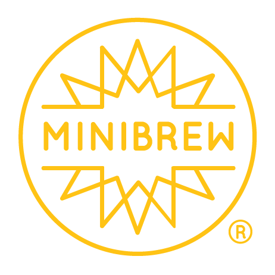

# MiniBrew Session Orchestrator



A production-grade, real-time MiniBrew brewing session orchestrator. Monitor and control your MiniBrew device — brewing states, fermentation, keg management, and CIP (clean-in-place) — via a live WebSocket dashboard backed by the MiniBrew API.

---

## Table of Contents

- [Features](#features)
- [Architecture](#architecture)
- [Prerequisites](#prerequisites)
- [Quick Start](#quick-start)
- [Installation](#installation)
- [Getting Your MiniBrew Bearer Token](#getting-your-minibrew-bearer-token)
- [Configuration](#configuration)
- [Running in Production](#running-in-production)
- [API Reference](#api-reference)
- [Frontend Dashboard](#frontend-dashboard)
- [Process States & Codes](#process-states--codes)
- [Troubleshooting](#troubleshooting)

---

## Features

- **Real-time WebSocket dashboard** — no browser polling; all updates pushed from the server
- **Multi-device management** — dropdown in header lists all devices across all operational buckets (brew_clean_idle, fermenting, serving, brew_acid_clean_idle); switch between devices instantly
- **Live device state interpretation** — process states, user actions, phases (Brewing, Fermentation, Serving, Cleaning) displayed as human-readable labels
- **Session management** — create brew, clean, and acid-clean sessions; issue state-aware commands
- **Session dropdown** — sorted by session ID descending (highest first); shows status, beer name, and process state in each option; active session marked with ★
- **Recipe browser** — list and browse all recipes from the MiniBrew API; view brew steps; start a brew session directly from any recipe
- **Beer styles reference** — browse available beer styles
- **Keg management** — serving mode, temperature control, beer name, reset
- **Command validation** — commands are validated against the current `user_action` before being sent to the device
- **Operator guidance** — step-by-step instructions fetched from the API and shown in the session detail panel when a user action is required
- **Failure state detection** — BREWING_FAILED, FERMENTATION_FAILED, SERVING_FAILED, CIP_FAILED shown in red with FAIL prefix
- **Settings panel** — update the bearer token at runtime without restarting; encrypted storage on the server
- **Responsive dark-mode UI** — works on desktop and tablet
- **Auto-refresh** — configurable 1/2/3/4/5/10 second polling intervals with source memory

---

## Architecture

```
┌─────────────────────────────────────────────────────────────────┐
│                        Browser (You)                             │
│            http://localhost:8080  (Dashboard UI)                 │
└────────────────────────┬────────────────────────────────────────┘
                         │ HTTP / WebSocket
                         ▼
┌─────────────────────────────────────────────────────────────────┐
│              Docker Compose  (minibrew-orchestrator)             │
│                                                                 │
│  ┌──────────────────┐         ┌──────────────────────────┐     │
│  │   nginx :80      │         │   FastAPI :8000           │     │
│  │  (static files)  │◄───────►│  (orchestrator backend)   │     │
│  │                  │  proxy   │                          │     │
│  └──────────────────┘         │  PollingWorker (2s)       │     │
│                               └────────────┬─────────────┘     │
│                                              │  HTTPS / REST   │
└──────────────────────────────────────────────┼─────────────────┘
                                               │
                                               ▼
                              ┌──────────────────────────────────┐
                              │   api.minibrew.io  (MiniBrew)   │
                              │   Bearer + client: Breweryportal │
                              └──────────────────────────────────┘
```

### Backend Services

| Service | File | Purpose |
|---------|------|---------|
| `MiniBrewClient` | `minibrew_client.py` | httpx wrapper; all API calls with `client: Breweryportal` header |
| `SessionService` | `session_service.py` | Brew, clean, acid-clean session CRUD; user_action steps; cleaning logs |
| `CommandService` | `command_service.py` | Command routing + user_action validation guards |
| `DeviceService` | `device_service.py` | breweryoverview ↔ device state sync; per-bucket storage |
| `KegService` | `keg_service.py` | Keg listing, commands, display-name |
| `RecipeService` | `recipe_service.py` | Recipe listing, detail, steps, creation |
| `PollingWorker` | `polling_worker.py` | Background asyncio poll loop every 2 seconds; fetches all brewery buckets |
| `WebSocketManager` | `websocket_manager.py` | Broadcasts to all connected browsers |
| `EventBus` | `event_bus.py` | Async pub/sub between services (in-memory singleton) |
| `StateEngine` | `state_engine.py` | ProcessState / UserAction / Phase maps |
| `DiffEngine` | `diff_engine.py` | Only broadcasts meaningful state changes |
| `StateStore` | `state_store.py` | In-memory singleton; per-bucket device state; all data ephemeral (gone on restart) |
| `SettingsStore` | `settings_store.py` | Fernet-encrypted token storage; hot-reload support |
| `AuthService` | `auth_service.py` | JWT auth scaffolding (currently bypassed in single-user mode) |
| `AuditService` | `audit_service.py` | JSONL append-only audit log at `/app/data/audit.log` |

---

## Prerequisites

- **Docker** (v20.10+) and **Docker Compose** (v2+)
- A MiniBrew account with an active device
- A MiniBrew API bearer token (see [Getting Your MiniBrew Bearer Token](#getting-your-minibrew-bearer-token))

---

## Quick Start

```bash
# 1. Clone the repo
git clone https://github.com/YOUR_USERNAME/minibrew-session-orchestrator.git
cd minibrew-session-orchestrator

# 2. Copy and edit environment
cp .env.example .env
# Edit .env — set MINIBREW_API_KEY and MINIBREW_API_BASE

# 3. Start (uses ./minibrew.sh wrapper — see Management Commands below)
./minibrew.sh build
```

The first time you load the dashboard with no stored token and no `.env` token, a **token gate** will appear requiring you to enter your bearer token before accessing anything.

---

## Installation

### 1. Clone the Repository

```bash
git clone https://github.com/YOUR_USERNAME/minibrew-session-orchestrator.git
cd minibrew-session-orchestrator
```

### 2. Configure Environment Variables

```bash
cp .env.example .env
```

Edit `.env`:

```env
# Required — your MiniBrew API bearer token
MINIBREW_API_KEY=your_token_here

# Required — the MiniBrew API base URL
MINIBREW_API_BASE=https://api.minibrew.io/v1/

# Optional — polling interval in milliseconds (default: 2000)
POLL_INTERVAL_MS=2000

# Optional — log level (default: INFO)
LOG_LEVEL=INFO
```

### 3. Start with the Management Wrapper

All stack management is done through the `minibrew.sh` wrapper script:

```bash
./minibrew.sh build    # Build images and start the stack
```

The script will display the access URLs after each command. See [Management Commands](#management-commands) for the full reference.

---

## Management Commands

All stack operations go through `./minibrew.sh`. This wrapper handles building, health checking, container lifecycle, and displays the access URLs automatically.

```bash
./minibrew.sh <command>
```

| Command | Description |
|---------|-------------|
| `./minibrew.sh build` | Build Docker images and start the full stack |
| `./minibrew.sh up` | Start the stack without rebuilding (uses existing images) |
| `./minibrew.sh down` | Stop and remove containers |
| `./minibrew.sh restart` | Restart the running stack |
| `./minibrew.sh rebuild` | Full rebuild: down + build + up |
| `./minibrew.sh backend` | Rebuild and restart backend container only |
| `./minibrew.sh frontend` | Rebuild and restart frontend container only |
| `./minibrew.sh status` | Show container status, health, and access URLs |
| `./minibrew.sh logs [svc]` | Tail logs (default service: backend). Example: `./minibrew.sh logs frontend` |
| `./minibrew.sh clean` | Remove all containers, volumes, and project images |
| `./minibrew.sh help` | Show this command reference |

After every command that starts the stack, `./minibrew.sh` prints the access URLs:

```
  Dashboard:  http://192.168.1.10:8080
  Backend:   http://192.168.1.10:8000
  API Docs:  http://192.168.1.10:8000/docs
```

The status command also shows container health (`✓ healthy`, `✗ unhealthy`), IP addresses, and port bindings.

### Changing the Compose File

By default `minibrew.sh` uses `docker-compose.yml`. To use a different file:

```bash
COMPOSE_FILE=docker-compose.prod.yml ./minibrew.sh up
```

---

## Getting Your MiniBrew Bearer Token

The bearer token authenticates you against the MiniBrew API. You need to extract it from an authenticated browser session.

### Steps

1. **Open the MiniBrew web app** in your browser and log in at [https://app.minibrew.io](https://app.minibrew.io) (or your regional URL).

2. **Open Developer Tools** — right-click anywhere → **Inspect** → go to the **Network** tab.

3. **Trigger an API call** — click on any device or session in the MiniBrew app to generate API traffic.

4. **Find an authenticated request** — in the Network tab, click any request to `api.minibrew.io`. Look at the **Request Headers** tab.

5. **Copy the Authorization header** — you will see:
   ```
   Authorization: Bearer eyJhbGc...
   ```
   Copy the full value after `Bearer ` (everything after the space).

6. **Paste it into your `.env`**:
   ```env
   MINIBREW_API_KEY=eyJhbGc...
   ```

### Alternative: Extract from Local Storage / Cookies

If you don't want to generate traffic:

1. In the browser DevTools, go to the **Application** tab.
2. Under **Storage** → **Cookies**, find the MiniBrew domain.
3. Look for a cookie named `auth_token` or similar — paste its value.

### Note

> Your token is personal. Do not commit `.env` to version control. The project includes `.env` in `.gitignore`.

---

## Configuration

### Environment Variables

| Variable | Required | Default | Description |
|----------|----------|---------|-------------|
| `MINIBREW_API_KEY` | Yes | — | Bearer token from your MiniBrew account |
| `MINIBREW_API_BASE` | Yes | `https://api.minibrew.io/v1/` | Base URL for the MiniBrew API |
| `POLL_INTERVAL_MS` | No | `2000` | How often to poll the MiniBrew API (ms) |
| `LOG_LEVEL` | No | `INFO` | Logging level: DEBUG, INFO, WARNING, ERROR |

### Runtime Token (Settings Panel)

If you don't have a token at startup, the UI blocks until you enter one. You can also update the token at any time via the **⚙ Settings** button in the header:

- **Save & Apply** — stores the token encrypted on the server (`/app/data/settings.json`) and hot-reloads it into all active connections immediately
- **Reset to .env default** — deletes the encrypted override and reverts to your `.env` token

The token is encrypted at rest using [Fernet](https://cryptography.io/en/latest/fernet/) (AES-128-CBC with PBKDF2 key derivation).

---

## Running in Production

### Exposing the Dashboard

To expose beyond localhost, create a `docker-compose.override.yml` (never commit this file):

```yaml
# docker-compose.override.yml
services:
  frontend:
    ports:
      - "80:80"
  backend:
    ports:
      - "8000:8000"
```

Then restart:
```bash
./minibrew.sh restart
```

For a reverse-proxy setup (Caddy, Traefik, Nginx), point the proxy to `http://localhost:8080`.

### Secrets Management

Instead of `.env`, you can pass secrets via Docker secrets or Kubernetes secrets:

```yaml
# docker-compose.prod.yml
services:
  backend:
    environment:
      - MINIBREW_API_BASE=https://api.minibrew.io/v1/
      - POLL_INTERVAL_MS=2000
    secrets:
      - minibrew_api_key

secrets:
  minibrew_api_key:
    file: ./secrets/minibrew_api_key.txt
```

### SSL/TLS Termination

The orchestrator does not handle TLS. Terminate SSL at your reverse proxy or use a service like Cloudflare Tunnel to expose `http://localhost:8080` securely.

### Database Persistence (Roadmap)

The `StateStore` is currently in-memory — all data is lost on backend restart. See `BACKEND_RECREATION_PLAN.md` for the full plan to add PostgreSQL + Celery + MQTT integration.

**Planned stack:**
- PostgreSQL: user accounts, session history, audit log, encrypted token vault
- Redis: state cache + Celery broker + WebSocket pub/sub (multi-replica)
- Celery: background task queue replacing the asyncio PollingWorker
- MQTT: real-time device events (lower latency than 2s polling)

---

## API Reference

### Backend REST Endpoints

All backend endpoints are proxied through nginx at `http://localhost:8080`.

| Method | Path | Description |
|--------|------|-------------|
| GET | `/health` | Liveness check |
| GET | `/settings/token` | Returns `{token_set, source}` — `source` is `"env"`, `"stored"`, or `null` |
| POST | `/settings/token` | Body: `{"token": "..."}` — save and hot-reload token |
| DELETE | `/settings/token` | Delete stored token, revert to `.env` |
| GET | `/verify` | Proxies `GET /breweryoverview/` — primary device status |
| GET | `/devices` | Proxies `GET /v1/devices/` — secondary device detail |
| GET | `/devices/all` | Returns all devices from all buckets with their bucket label |
| POST | `/device/select` | Body: `{bucket}` — switch active bucket/device |
| GET | `/sessions` | List all sessions |
| POST | `/sessions` | Create session. Body: `{session_type, minibrew_uuid, beer_recipe}` |
| DELETE | `/sessions/{id}` | Terminate session |
| GET | `/sessions/{id}` | Get session detail |
| POST | `/sessions/{id}/wake-then-delete` | Send wake (type 2), wait 1s, then delete |
| GET | `/sessions/{id}/user-action/{action_id}` | Fetch operator step-by-step guidance |
| GET | `/sessions/{id}/cleaning-logs` | Fetch cleaning process logs |
| POST | `/session/{id}/command` | Send command. Body: `{command, params}` |
| GET | `/recipes` | List all recipes |
| GET | `/recipes/{id}` | Get recipe detail with brew steps |
| GET | `/recipes/{id}/steps` | Get recipe brew steps |
| GET | `/beers` | List all beers |
| GET | `/beer-styles` | List all beer styles |
| GET | `/kegs` | List all kegs |
| POST | `/keg/{uuid}/command` | Send keg command |
| POST | `/keg/{uuid}/display-name` | Update keg display name |
| WS | `/ws` | WebSocket — receives `initial_state`, `device_update`, `session_update`, `bucket_changed`, `system_event` |

### WebSocket Messages (Server → Client)

```json
{ "type": "initial_state",  "payload": { "sessions": [], "kegs": [], "devices": [], "selected_bucket": "brew_clean_idle", "device": {...} } }
{ "type": "device_update",   "payload": { "sessions": [], "kegs": [], "devices": [], "selected_bucket": "brew_clean_idle" } }
{ "type": "session_update", "payload": { ...session... } }
{ "type": "bucket_changed",  "payload": { "bucket": "fermenting", "sessions": [] } }
{ "type": "system_event",   "payload": { ... } }
```

### WebSocket Messages (Client → Server)

```json
{ "type": "select_bucket", "bucket": "fermenting" }  // Switch active device bucket
{ "type": "ping" }                                        // Heartbeat — server replies { "type": "pong" }
```

### MiniBrew API

The backend proxies to `https://api.minibrew.io/v1/` with:
- Header `Authorization: Bearer <token>`
- Header `client: Breweryportal`

---

## Frontend Dashboard

### Layout

```
┌──────────────────────────────────────────────────────────────┐
│ [MiniBrew] [Device: ▼ brew_clean_idle]  ⚙  [phase] IDLE  🟢│ ← Navbar
├───────────────┬──────────────────────────────────────────────┤
│ Brewery Status│                                              │
│ Sessions      │  Device Info  UUID: 2403B0994-SHNCANKM     │
│ Recipes       │  Process State: 0 (IDLE)  User Action: 12  │
│ Commands      │  Current Temp: —    Target Temp: —           │
│               ├─────────────────────┬────────────────────────┤
│               │  Base Station       │  Kegs                  │
│               │  [Next Step] ...    │  [keg dropdown]        │
│               │  [Clean After Brew] │  [Set Temp] [Serving]  │
├───────────────┴──────────────────────────────────────────────┤
│ Console  ✕                                                 │
│ [12:34:56] WebSocket connected                              │
└──────────────────────────────────────────────────────────────┘
```

The navbar has four tabs: **Brewery Status**, **Sessions**, **Recipes**, **Commands**.

### Sessions Tab

Sessions are shown in a **sorted dropdown** (highest session ID first, most recent by default). The dropdown shows `#ID [Status] BeerName State ★` per option. Selecting a session loads its detail panel with operator instructions if a user action is required.

### Creating Sessions

1. Click **+ Brew**, **+ Clean**, or **+ Acid Clean**
2. Enter your MiniBrew **UUID** (e.g. `2403B0994-SHNCANKM`)
3. For brew sessions, optionally enter a recipe ID
4. Click **Create** — the new session appears at the top of the dropdown

### Recipes Tab

Click **↻ Load Recipes** to fetch all recipes from the MiniBrew API. Click any recipe to see its brew steps. Enter a device UUID and click **Start Brew Session** to begin brewing from that recipe.

### Token Gate

If no token is found (neither `.env` nor stored), the entire dashboard is blocked by a full-screen token entry screen:

```
┌────────────────────────────────────────┐
│        [MiniBrew Logo]                 │
│   MiniBrew Session Orchestrator        │
│                                        │
│   No API token found. Enter your       │
│   MiniBrew bearer token to continue.   │
│                                        │
│   [__________________________]        │
│   [       Connect      ]              │
└────────────────────────────────────────┘
```

---

## Process States & Codes

All numerical codes are displayed as `X (LABEL)`. Unknown codes display as `X (NULL)` in **red**. Failure states get a `FAIL:` prefix.

### ProcessState Codes

| Code | Label | Phase |
|------|-------|-------|
| 0 | IDLE_STATE | — |
| 5 | MANUAL_CONTROL_STATE | — |
| 24 | MASH_IN_STATE | BREWING |
| 30 | MASHING_HEATUP_STATE | BREWING |
| 31 | MASHING_MAINTAIN_STATE | BREWING |
| 40 | LAUTERING_STATE | BREWING |
| 43 | REPLACE_MASH_STATE | BREWING |
| 50 | BOILING_HEATUP_STATE | BREWING |
| 51 | BOILING_MAINTAIN_STATE | BREWING |
| 60 | COOL_WORT_STATE | BREWING |
| 70 | BREWING_DONE_STATE | BREWING |
| **71** | **BREWING_FAILED_STATE** | **BREWING (FAIL)** |
| 75 | PREPARE_FERMENTATION_STATE | FERMENTATION |
| 80 | FERMENTATION_TEMP_CONTROL_STATE | FERMENTATION |
| **84** | **FERMENTATION_FAILED_STATE** | **FERMENTATION (FAIL)** |
| 88 | PREPARE_SERVING_STATE | SERVING |
| 90 | COOL_BEFORE_SERVING_STATE | SERVING |
| 91 | MOUNT_TAP_STATE | SERVING |
| 92 | SERVING_TEMP_CONTROL_STATE | SERVING |
| **93** | **SERVING_FAILED_STATE** | **SERVING (FAIL)** |
| 101 | PREPARE_CIP_STATE | CLEANING |
| 103 | BACKFLUSH_STATE | CLEANING |
| 108 | CIP_DONE_STATE | CLEANING |
| **109** | **CIP_FAILED_STATE** | **CLEANING (FAIL)** |

### UserAction Codes

| Code | Label |
|------|-------|
| 0 | None |
| 2 | Prepare cleaning |
| 3 | Add cleaning agent |
| 4 | Fill water |
| 5 | Ready to clean |
| 12 | Needs cleaning |
| 13 | Needs acid cleaning |
| 21 | Start brewing |
| 22 | Add ingredients |
| 23 | Mash in |
| 24 | Heat to mash |
| 25 | Mash done |
| 26 | Prepare fermentation |
| 27 | Cool to fermentation |
| 28 | Add yeast |
| 30 | Fermentation complete |
| 31 | Transfer to serving |
| 32 | Start cleaning |
| 33 | Rinse |
| 34 | Acid clean |
| 35 | Sanitize |
| 36 | Finished cleaning |
| 37 | CIP Finished |

---

## Troubleshooting

### Backend returns 401 or 403 from MiniBrew API

Your bearer token has expired or is invalid. Open the Settings panel (⚙) and enter a fresh token. See [Getting Your MiniBrew Bearer Token](#getting-your-minibrew-bearer-token).

### WebSocket shows disconnected (⚫)

The backend is unreachable. Check:
```bash
./minibrew.sh status
# Both containers should be ● running and healthy

curl http://localhost:8080/health
# Should return {"status":"ok"}
```

### Device Info panel shows no data

Make sure your device UUID is correct and the MiniBrew device is online. Check the console log at the bottom of the dashboard for error messages:
```bash
./minibrew.sh logs
```

### Token gate appears even with `.env` configured

The `MINIBREW_API_KEY` variable must be set in `.env` and the backend container must be rebuilt to pick up new env vars:
```bash
./minibrew.sh backend
```

### Changes to .env require restart

Yes — `./minibrew.sh restart` picks up new env vars. Alternatively, use the **⚙ Settings** panel to update the token at runtime without restarting.
